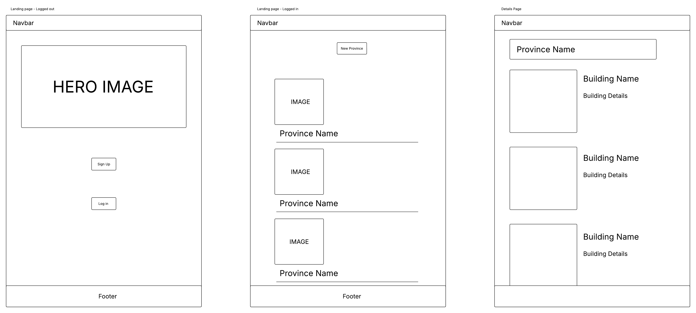
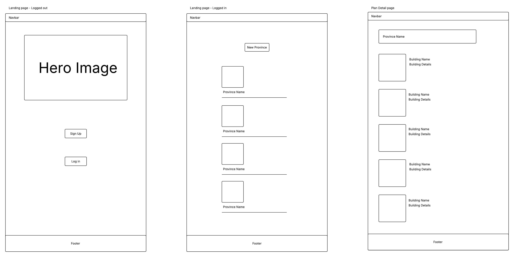
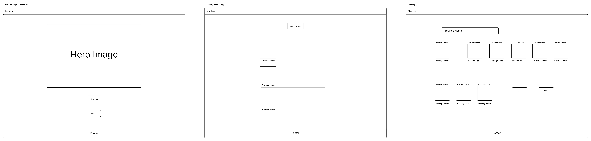
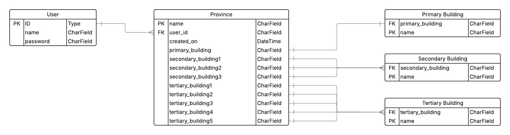
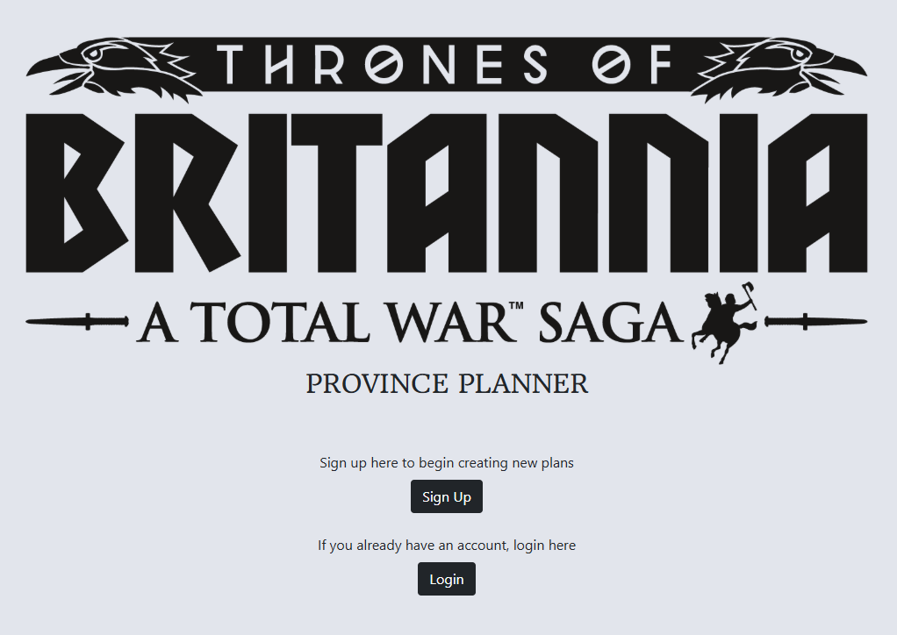
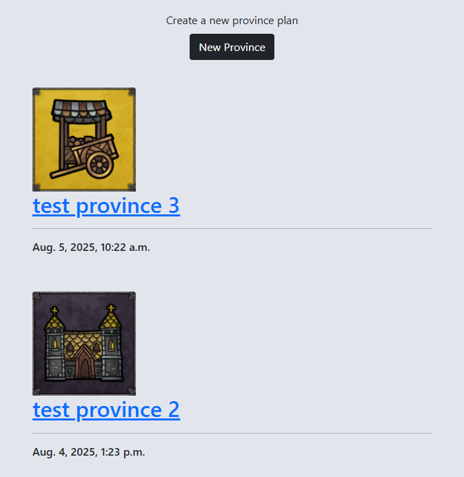
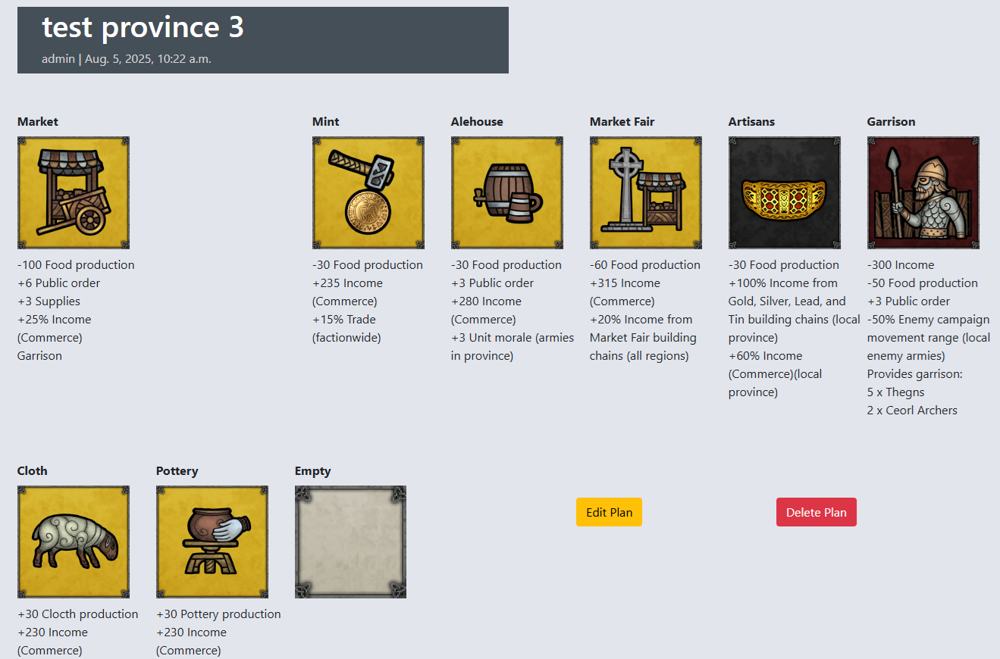
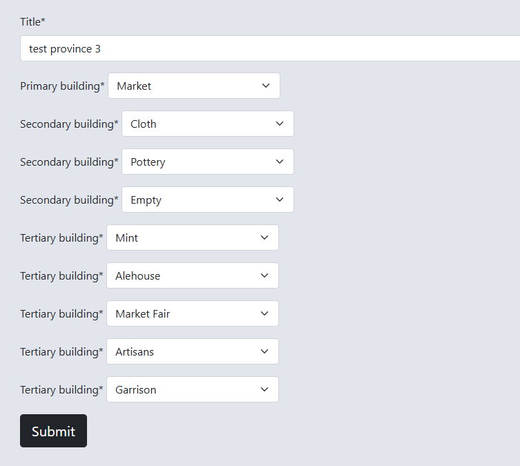

# TOB-Province-Planner

## Overview

The Thrones of Britannia - Province Planner, has been made as a tool for planning provinces in the game Thrones of Britannia - Total War.

Provinces are a key part of the game, providing food for armies, income, and many different resources. The income is divided into several different types such as 'Commerce', 'Church', 'Farm'. There are many buildings the player can choose from but only a limited amount of space for them in every province, therefore this planner was created so that users could create a preview of a complete province for themselves.

Further development of the project would implement an optimisation tool, to automatically suggest an ideal set of buildings to optimise for example, food or income.

The deployed site can be viewed <a href="https://tob-province-planner-4fc3e7628529.herokuapp.com/">here</a>.

### Languages used in this project

HTML
CSS
Javascript
Python

## User Experience Design

### Colour Palette
I chose a simple monochrome colour scheme for the website. The images for the buildings in the planner itself provide more colour and vibrancy.


### Wireframes

Wireframes for the application were made using lucidchart.

I wanted to make sure that the information being presented to the user was as clear as possible, therefore I went for a fairly simple design to avoid cluttering the screen with information.

<details>
  <summary>Mobile Wireframe</summary>


</details>

<details>
  <summary>Tablet Wireframe</summary>


</details>

<details>
  <summary>Desktop Wireframe</summary>


</details>

### ERD

I used lucidchart to create the ERD for my project.


## Features

<details>
  <summary>The site features a landing page with CTAs to login or signup to begin creating new content.</summary>


</details>

<details>
  <summary>AllAuth is used for user authentication, upon logging in the user can view their existing plans and create new ones, existing plans are in a paginated display with 6 plans per page.</summary>


</details>

<details>
  <summary>The details of each plan can be viewed seperately, where the user can edit or delete their plan.</summary>


</details>

<details>
  <summary>When creating or editing a plan, the user is taken to a form page where they can select the buildings that will appear in the plan.</summary>


</details>

## Agile

A <a href="https://github.com/users/dav-noble/projects/10" target="_blank">Project Board</a> was used during the creation process, with MoSCoW prioritisation.
All must-have user stories were implemented.

## Testing

### HTML Validation
All HTML pages have been tested with the w3c validator and passed with no errors.

### CSS Validation
The style.css file has been passed through the CSS validator and passed with no errors.

### JS Hint
The plan_details.js file has been passed through JS Hint and passed with no errors.

### Lighthouse

The Chrome Dev Tools Lighthouse was used to test performance, accessibility, best practises, and SEO for the site's pages.

<a href="./assets/images/readme/lighthouse-index.png" target="_blank">index.html - logged out</a>

<a href="./assets/images/readme/lighthouse-index-loggedin.png" target="_blank">index.html - logged in</a>

<a href="./assets/images/readme/lighthouse-plandetail.png" target="_blank">plan_detail.html</a>

<a href="./assets/images/readme/lighthouse-planform.png" target="_blank">plan_form.html</a>

<a href="./assets/images/readme/lighthouse-login.png" target="_blank">login.html</a>

<a href="./assets/images/readme/lighthouse-logout.png" target="_blank">logout.html</a>

<a href="./assets/images/readme/lighthouse-signup.png" target="_blank">signup.html</a>

### Manual Testing

The site was thoroughly tested to make sure all links were functioning properly and the pages were responsive to different screen sizes. The results of the tests
are shown <a href="https://docs.google.com/spreadsheets/d/1HD1odPErTh6_IvlrukNYchlnZoIuZD1ERMWiOSmXS3o/edit?usp=sharing>">here</a>.

### User Stories

A review of the user stories for this project. The MVP has been achieved, with further functionality to be implemented outside of the project.

| User Story | Expected outcome | Result |
|------------|------------------|-------------|
| As a site admin, I can create, read, update, and delete province plans. (must-have) | A logged in admin can use the admin panel to create, read, update, and delete plans | Pass |
| As a site user, I can sign up and login so that I begin creating province plans. (must-have) | The site has sign up and login functionality using AllAuth | Pass |
| As a site user, I can view a paginated list of province plans so that I can select which plans I want to view (must-have) | A list of plans the user has created is visible, with 6 plans per page | Pass |
| As a site user, I can create province plans so that I can see the details of a complete province. (must-have) | The user can submit a form to create new province plans | Pass |
| As a site user, I can click on a plan so that I can read the details of the province plan. (must-have) | There is a details page with each building in the province shown | Pass |
| As a site user I can modify or delete province plans that I have previously created. (must-have) | 2 buttons, edit and delete, are on the details page, with which the user can edit or delete their existing plan | Pass |
| As a site user, I can view the details of a province's buildings so that I can be informed on the province's output. (should-have) | The plan details page has further information for each building in the province plan | Pass |
| As a site user, I can select primary and secondary buildings in the planner, so that relevant tertiary buildings are added to the form as choices. (should-have) | On the plan form page, selecting a primary or secondary building populates the tertiary building dropdowns with relevant choices | Fail |
| As a site user, I can optimise a province so that I can receive guidance on what buildings to construct. (could-have) | There is an optimise button that calculates the best combination of tertiary buildings for the desired output | Fail |

## Deployment

1. Create a Heroku account
2. Create a new app
3. On the 'settings' tab under Config vars, add the DATABASE_URL and SECRET_KEY
4. Install web server gunicorn and freeze to requirements.txt
5. Create a Procfile in the root directory of your project with the code ```web: gunicorn "proj_name".wsgi```
6. Add deployed app to ALLOWED_HOSTS in settings.py file
7. Connect Heroku to the git repository in the Deploy tab, choose GitHub as the deployment method and search for the GitHub repository
8. Manually deploy the the branch
9. Inside the resources tab, ensure the project is using an Eco-Dyno and delete any Postgres DB addons

## AI Implementation

Microsoft Copilot was used throughout the project, mostly as a tool for bugfixing. With a prompt detailing the problem and desired outcome it could swiftly scan my code to identify the problem. This method saved a great deal of time and effort for me.

When stuck on how to implement a feature the AI was helpful in suggesting code, although care was taken to understand the workings of the code before adding it to the project. At times the AI would suggest different methods to achieve the same result, at which point I would manually implement only one of the methods for consistency.

Use of AI was helpful with repetitive tasks such as wrapping multiple lines of code in seperate divs.

AI was not used for the creation of automated unit tests, as I manually tested the application features.

## Credits

- Code Institute's 'I Think Therefore I Blog' content was used as a base which I modified extensively for the project.
- Google Fonts - for the Headland One font used on the landing page
- Font Awesome - For the linked in icon in the footer of the application
- Bootstrap - used throughout the site for layout and screen size responsiveness
